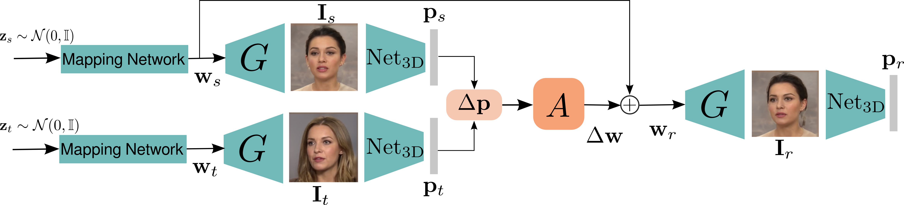
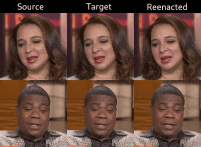
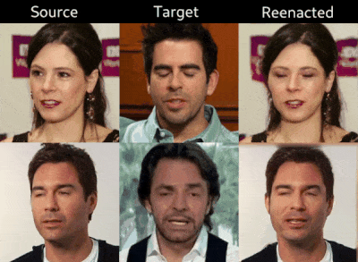

# Finding Directions in GAN's Latent Space for Neural Face Reenactment

Authors official PyTorch implementation of the **[Finding Directions in GAN's Latent Space for Neural Face Reenactment](https://arxiv.org/abs/2202.00046)**. This paper has been accepted for publication at British Machine Vision Conference (BMVC), 2022. If you use this code for your research, please [**cite**](#citation) our paper.

<p align="center">

</p>

>**Finding Directions in GAN's Latent Space for Neural Face Reenactment**<br>
> Stella Bounareli, Vasileios Argyriou, Georgios Tzimiropoulos<br>
>
> **Abstract**: This paper is on face/head reenactment where the goal is to transfer the facial pose (3D head orientation and expression) of a target face to a source face. Previous methods focus on learning embedding networks for identity and pose disentanglement which proves to be a rather hard task, degrading the quality of the generated images. We take a different approach, bypassing the training of such networks, by using (fine-tuned) pre-trained GANs which have been shown capable of producing high-quality facial images. Because GANs are characterized by weak controllability, the core of our approach is a method to discover which directions in latent GAN space are responsible for controlling facial pose and expression variations. We present a simple pipeline to learn such directions with the aid of a 3D shape model which, by construction, already captures disentangled directions for facial pose, identity and expression. Moreover, we show that by embedding real images in the GAN latent space, our method can be successfully used for the reenactment of real-world faces. Our method features several favorable properties including using a single source image (one-shot) and enabling cross-person reenactment. Our qualitative and quantitative results show that our approach often produces reenacted faces of significantly higher quality than those produced by state-of-the-art methods for the standard benchmarks of VoxCeleb1 & 2. 

<a href="https://arxiv.org/abs/2202.00046"></a>
<a href="https://stelabou.github.io/stylegan-directions-reenactment/"></a>

*Pretrained models and code are coming soon.*

## Face Reenactment Results on VoxCeleb1 dataset

> Real image editing of head pose and expression

<p align="center">

</p>

> Self and Cross-subject Reenactment

<p align="center">


</p>


## Citation

[1] Stella Bounareli, Argyriou Vasileios and Georgios Tzimiropoulos. Finding Directions in GAN's Latent Space for Neural Face Reenactment.

Bibtex entry:

```bibtex
@article{bounareli2022finding,
  title={Finding Directions in GAN's Latent Space for Neural Face Reenactment},
  author={Bounareli, Stella and Argyriou, Vasileios and Tzimiropoulos, Georgios},
  journal={arXiv preprint arXiv:2202.00046},
  year={2022}
}

```