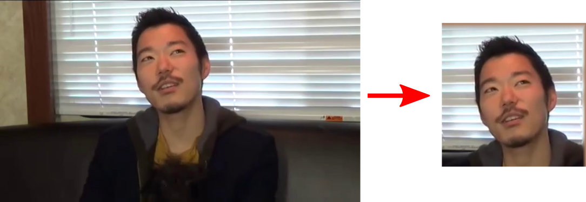

# Finding Directions in GAN's Latent Space for Neural Face Reenactment

Authors official PyTorch implementation of the **[Finding Directions in GAN's Latent Space for Neural Face Reenactment](https://arxiv.org/abs/2202.00046)**. This paper has been accepted as an oral presentation at British Machine Vision Conference (BMVC), 2022. If you use this code for your research, please [**cite**](#citation) our paper.

<p align="center">

</p>

>**Finding Directions in GAN's Latent Space for Neural Face Reenactment**<br>
> Stella Bounareli, Vasileios Argyriou, Georgios Tzimiropoulos<br>
>
> **Abstract**: This paper is on face/head reenactment where the goal is to transfer the facial pose (3D head orientation and expression) of a target face to a source face. Previous methods focus on learning embedding networks for identity and pose disentanglement which proves to be a rather hard task, degrading the quality of the generated images. We take a different approach, bypassing the training of such networks, by using (fine-tuned) pre-trained GANs which have been shown capable of producing high-quality facial images. Because GANs are characterized by weak controllability, the core of our approach is a method to discover which directions in latent GAN space are responsible for controlling facial pose and expression variations. We present a simple pipeline to learn such directions with the aid of a 3D shape model which, by construction, already captures disentangled directions for facial pose, identity and expression. Moreover, we show that by embedding real images in the GAN latent space, our method can be successfully used for the reenactment of real-world faces. Our method features several favorable properties including using a single source image (one-shot) and enabling cross-person reenactment. Our qualitative and quantitative results show that our approach often produces reenacted faces of significantly higher quality than those produced by state-of-the-art methods for the standard benchmarks of VoxCeleb1 & 2. 

<a href="https://arxiv.org/abs/2202.00046"></a>
<a href="https://stelabou.github.io/stylegan-directions-reenactment/"></a>

## Face Reenactment Results on VoxCeleb1 dataset

> Real image editing of head pose and expression

<p align="center">

</p>

> Self and Cross-subject Reenactment

<p align="center">


</p>


# Installation

* Python 3.5+ 
* Linux
* NVIDIA GPU + CUDA CuDNN
* Pytorch (>=1.5)
* [Pytorch3d](https://github.com/facebookresearch/pytorch3d)
* [DECA](https://github.com/YadiraF/DECA)

We recommend running this repository using [Anaconda](https://docs.anaconda.com/anaconda/install/).  

```
conda create -n python38 python=3.8
conda activate python38
conda install pytorch==1.7.0 torchvision==0.8.0 cudatoolkit=11.0 -c pytorch
conda install -c fvcore -c iopath -c conda-forge fvcore iopath
conda install pytorch3d -c pytorch3d 
pip install -r requirements.txt

```

# Pretrained Models

We provide a StyleGAN2 model trained using [StyleGAN2-ada-pytorch](https://github.com/NVlabs/stylegan2-ada-pytorch) and an [e4e](https://github.com/omertov/encoder4editing) inversion model trained on [VoxCeleb1](https://www.robots.ox.ac.uk/~vgg/data/voxceleb/vox1.html) dataset. 


| Path | Description
| :--- | :----------
|[StyleGAN2-VoxCeleb1](https://drive.google.com/file/d/1cBwIFwq6cYIA5iR8tEvj6BIL7Ji7azIH/view?usp=sharing)  | StyleGAN2 trained on VoxCeleb1 dataset.
|[e4e-VoxCeleb1](https://drive.google.com/file/d/1TRATaREBi4VCMITUZV0ZO2XFU3YZKGlQ/view?usp=share_link)  | e4e trained on VoxCeleb1 dataset.


# Auxiliary Models

We provide additional auxiliary models needed during training.

| Path | Description
| :--- | :----------
|[face-detector](https://drive.google.com/file/d/1IWqJUTAZCelAZrUzfU38zK_ZM25fK32S/view?usp=share_link)  | Pretrained face detector taken from [face-alignment](https://github.com/1adrianb/face-alignment).
|[IR-SE50 Model](https://drive.google.com/file/d/1s5pWag4AwqQyhue6HH-M_f2WDV4IVZEl/view?usp=sharing)  | Pretrained IR-SE50 model taken from [InsightFace_Pytorch](https://github.com/TreB1eN/InsightFace_Pytorch) for use in our identity loss.
|[DECA model](https://drive.google.com/file/d/1qZxbF13uuUpp-tCJ0kFIbSWH7h_Y-q2m/view?usp=sharing)  | Pretrained model taken from [DECA](https://github.com/YadiraF/DECA). Extract data.tar.gz under  `./libs/DECA/`.


By default, we assume that all pretrained models are downloaded and saved to the directory `./pretrained_models`. 


# Preparing your Data

1. Download and preprocess the VoxCeleb dataset using [VoxCeleb_preprocessing](https://github.com/StelaBou/voxceleb_preprocessing).


2. Invert real images into the latent space of the pretrained StyleGAN2 using the [Encoder4Editing](https://arxiv.org/abs/2102.02766) method. 
```
python invert_images.py --input_path path/to/voxdataset
```

The dataset is saved as: 

```
.path/to/voxdataset
|-- id10271                           # identity index
|   |-- 37nktPRUJ58                   # video index
|   |   |-- frames_cropped            # preprocessed frames
|   |   |   |-- 00_000025.png
|   |   |   |-- ...
|   |   |-- inversion
|   |   |    |-- frames               # inverted frames
|   |   |    |   |-- 00_000025.png
|   |   |    |   |-- ..
|   |   |    |-- latent_codes         # inverted latent_codes
|   |   |    |   |-- 00_000025.npy
|   |   |    |   |-- ..
|   |-- Zjc7Xy7aT8c
|   |   | ...
|-- id10273
|   | ...
```

The correct preprocessing of the dataset is important to reenact the images. Different preprocessing will lead in poor performance.
Example:
<p align="center">

</p>

# Training 

To train our model, make sure to download and save the required models under `./pretrained_models` path and that the training and testing data are configured as described above. Please check `run_trainer.py` and `./libs/configs/config_arguments.py` for the training arguments.

Example of training using paired data:
```
python run_trainer.py \
--experiment_path ./training_attempts/exp_v00 \
--train_dataset_path path_to_training_dataset \
--test_dataset_path path_to_test_dataset \
--training_method paired
```


# Inference 
Download our pretrained model [A-matrix](https://drive.google.com/file/d/11aNalhBnPREFQT9i9wmQE0-fkQac4SzQ/view?usp=share_link) and save it under `./pretrained_models` path.

## Facial image editing:

Given as input an image or a latent code, change only one facial attribute that corresponds to one of our learned directions. 
```
python run_facial_editing.py \
  --source_path ./inference_examples/0002775.png \
  --output_path ./results/facial_editing \
  --directions 0 1 2 3 4 \
  --save_gif \
  --optimize_generator
```

## Face reenactment (self or cross):

Given as input a source identity and a target video, reenact the source face. The source and target faces could have the same identity or different identity.
```
python run_inference.py \
  --source_path ./inference_examples/0002775.png \
  --target_path ./inference_examples/lWOTF8SdzJw#2614-2801.mp4 \
  --output_path ./results/ \
  --save_video
```


# Citation

[1] Stella Bounareli, Argyriou Vasileios and Georgios Tzimiropoulos. Finding Directions in GAN's Latent Space for Neural Face Reenactment.

Bibtex entry:

```bibtex
@article{bounareli2022finding,
  title={Finding Directions in GAN's Latent Space for Neural Face Reenactment},
  author={Bounareli, Stella and Argyriou, Vasileios and Tzimiropoulos, Georgios},
  journal={British Machine Vision Conference (BMVC)},
  year={2022}
}

```
